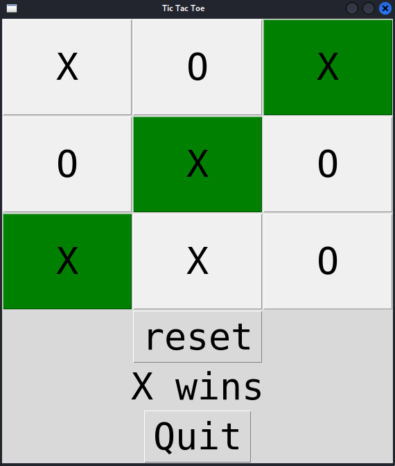
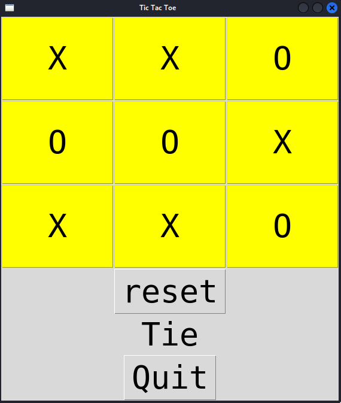
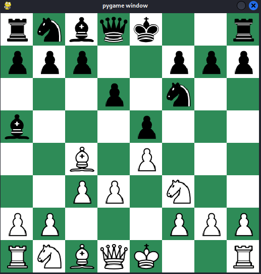

# Summer 2023 Game Collection 🎮

Welcome to my collection of games, created during the summer break of 2023 as a fun side project! 🌞🎉

The main goal was to learn `Tkinter` and use my `algorithmic knowledge` to build game mechanics.

## Sapper 🧨

Sapper is a logic-based game where the goal is to clear a grid of hidden mines without detonating any of them. The player clicks on cells to reveal numbers that indicate how many mines are adjacent to that cell. Using logic and deduction, the player must carefully flag all the mines and clear the board to win.

## TicTacToe ⭕️❌⭕️❌

Tic-Tac-Toe is a simple, two-player game where the objective is to get three of your marks in a row—horizontally, vertically, or diagonally—on a 3x3 grid. Players take turns placing either an "X" or an "O" in empty spaces, and the first to align three of their symbols wins. If the grid is filled and no one has won, the game ends in a draw.

## Chess ♟️👑

Chess is a classic board game that dates back over a thousand years, with origins believed to be in India around the 6th century. Played on an 8x8 board, it’s a two-player strategy game where the goal is to checkmate the opponent’s king.

My implementation of chess is quite basic, and I've never fully finished the project. However, it is still playable if both players know the rules. Some key functionalities like castling and promotions are not implemented and the game doesn't enforce move legality. So, as I mentioned, it is important for the players to follow the rules themselves while playing.