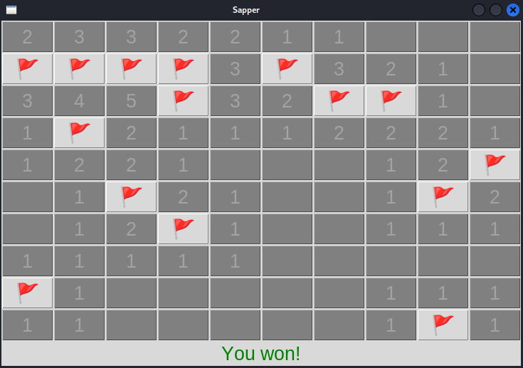

# Summer 2023 Game Collection 🎮

Welcome to my collection of games, created during the summer break of 2023 as a fun side project! 🌞🎉

The main goal was to learn `Tkinter` and use my `algorithmic knowledge` to build game mechanics.

## Sapper 🧨

Sapper is a logic-based game where the goal is to clear a grid of hidden mines without detonating any of them. The player clicks on cells to reveal numbers that indicate how many mines are adjacent to that cell. Using logic and deduction, the player must carefully flag all the mines and clear the board to win.

## TicTacToe

## Chess